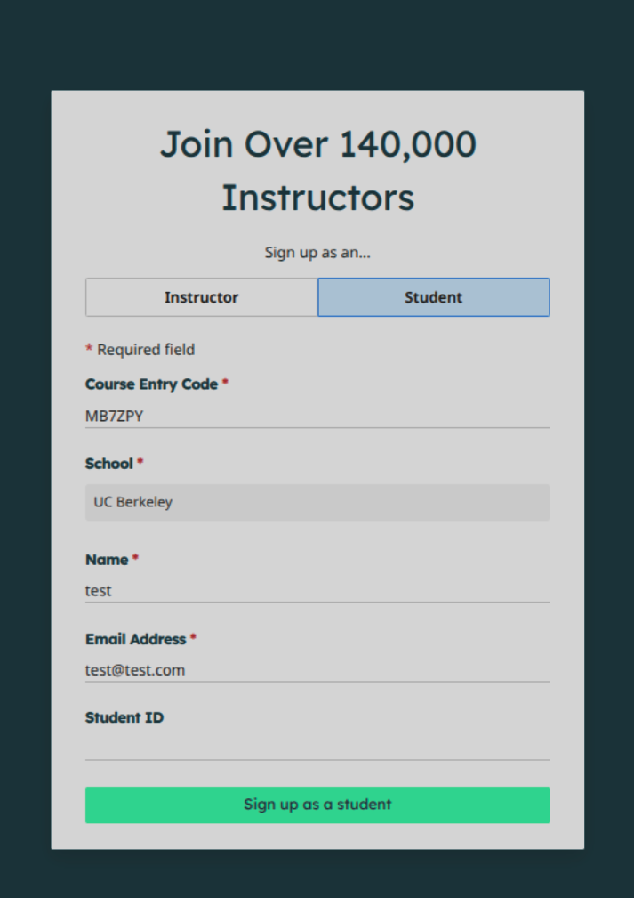

**在此感谢本文主要笔者 24级ACM俱乐部成员 pterocaryz**

# CS61B 简介

[🔗CS61B](https://sp21.datastructur.es/) 是加州大学伯克利分校（UC Berkeley）开设的 CS61 系列第二门核心课程，重点聚焦于 **数据结构与算法设计**，本文是对于该课程的简介。

## 课程资源与亮点

这门课与 CS61A 风格类似，拥有极为完善的配套资源：

- **教学资源完备**：包含详尽的官方文档、高质量教学视频与配套课件，大部分问题可以通过阅读官方文档解决。
- **实践体系扎实**：配备了极具含金量的 *lab*、*homework* 与 *project*，以及对应的自动化评测系统。
- **高度开源**：课程资料大部分开源，其中 **2021 年春季（Spring 2021）** 版本为完全开源。

## 推荐版本与 Gradescope 评测配置

推荐学习 **2021 年春季版本**。该版本不仅资料完全公开，还支持配置官方评测。

> [!note]
>
> 官方评测是通过第三方网站 [🔗gradescope](https://www.gradescope.com/) 完成的
>
> 该网站注册时坑点较多，务必按照下面步骤操作

### 注册流程

1. 访问 [🔗gradescope.com](https://www.gradescope.com/)，选择作为学生（Student）注册。

2. **填写信息**：

   - **Course Entry Code** 栏：`MB7ZPY`
   - **School** 栏：填写并在下拉框选择 `UC Berkeley` <s>（别填其他学校，找不到的）</s>

   > [!important]
   >
   > 填写 `UC Berkeley` 后可能需要一点时间下拉框才会显示该选项
   >
   > **不要选择立刻出现的 `2U - UC Berkeley`**

   - 后面的 *姓名* (**Name**) 和 *邮箱* (**Email Address**) 两栏填写后即可注册

填写大致如下：

</img>

### 作业提交

完成注册后，即可在线评测作业。支持直接打包 `.zip` 上传，或关联自己的 GitHub 仓库提交。

## 语言门槛与核心项目

- **零基础过渡 Java**：作业基于 Java，但无需担心语言门槛。课程前几周会从面向对象（OOP）讲起，循序渐进带你掌握 Java。只要有任意一门编程语言基础，上手会非常顺畅。
- **工程素养培养**：课程早期会详细介绍 IntelliJ IDEA 的工程化使用、单元测试（Unit Testing）等实用开发技能。
- **经典项目 Gitlet**：课程包含经典的 Project —— 手写轻量版 Git（**Gitlet**）。项目会先深入剖析 Git 底层逻辑，帮助你透彻理解 *Commit*、*Branch*、*Blob*、*Staging Area* 等核心概念与内部机制。

> [!note]
>
> 课程配套的的 [🔗*reading*](https://joshhug.gitbooks.io/hug61b/content/) 写的很详细，结合其教学视频能快速理清课程，把任务点串起来。
>
> 课程中的任务（*lab*、*homework*、*project*）大多都有详细的说明， 有不清楚的地方可以在主页多找找文档

## 了解更多

更多课程细节与学习指南可参考 CSDIY 页面：
- [🔗CS61B: Data Structures and Algorithms](https://csdiy.wiki/数据结构与算法/CS61B/?h=cs61b)

课程完整汉化版：
- [🔗docs.everlasting.xin](https://docs.everlasting.xin/CS61B/2021Spring/)

课程代码框架
- [🔗Berkeley-CS61B/skeleton-sp21]https://github.com/Berkeley-CS61B/skeleton-sp21