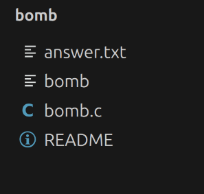
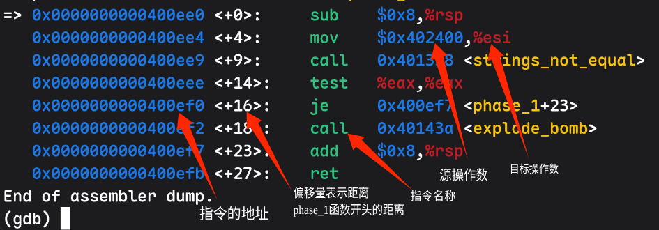
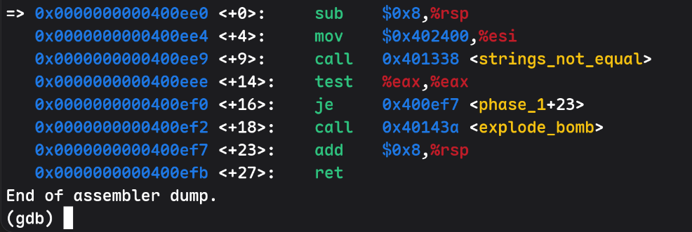
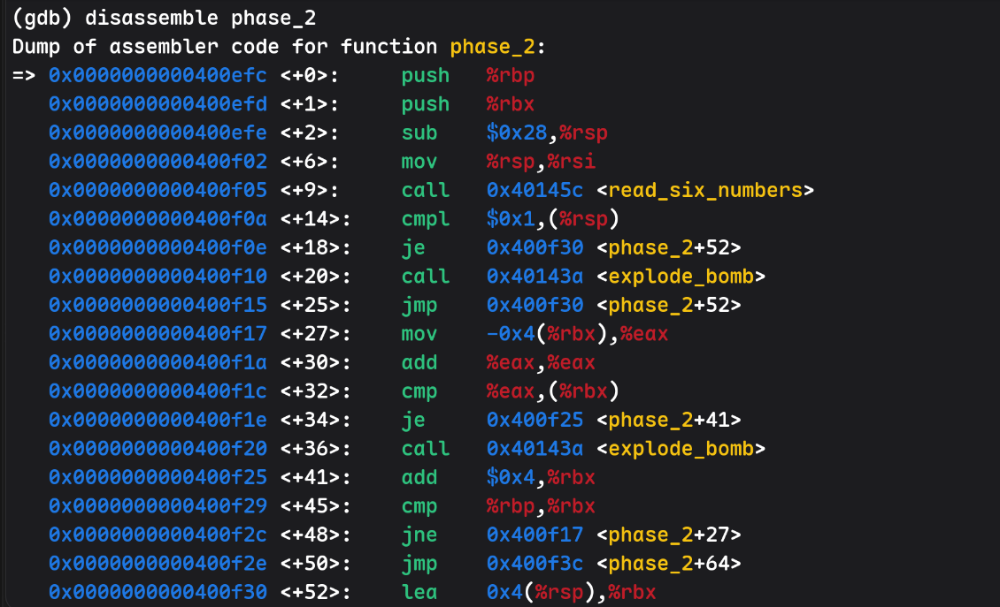
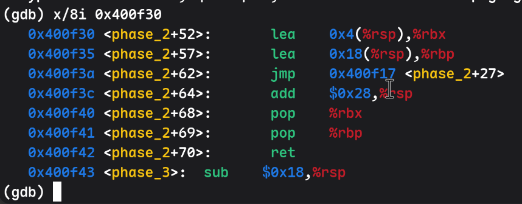
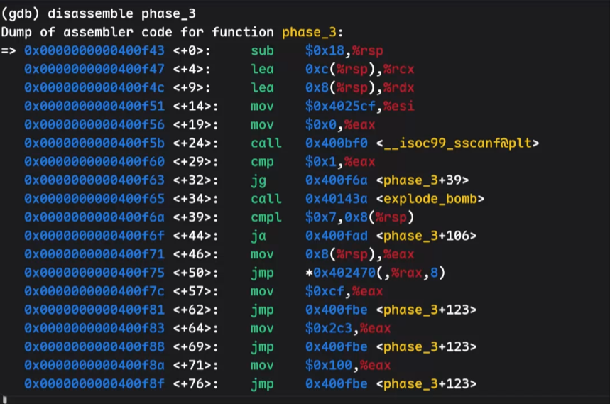
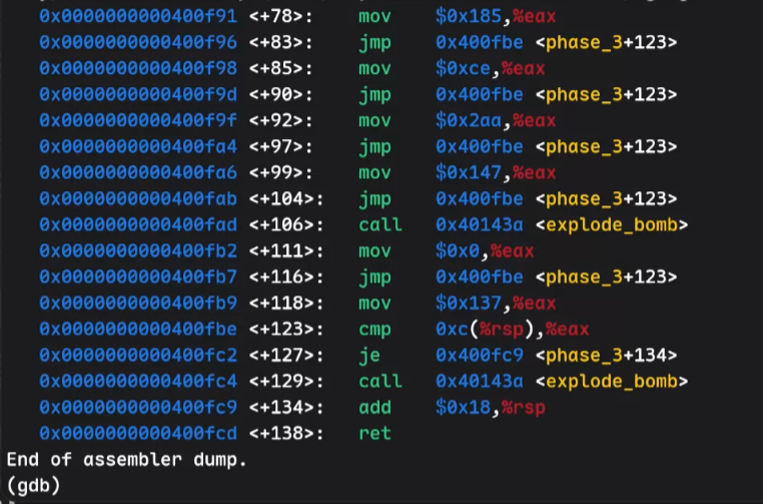
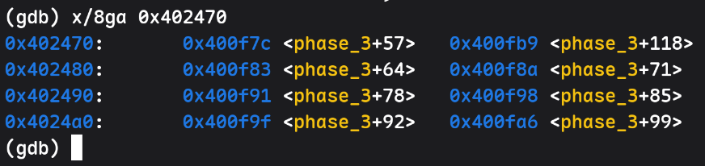
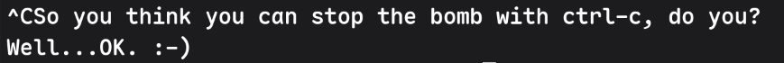

**在此感谢本文主要笔者 25级ACM俱乐部成员 Chord**

# Bomb lab

本篇讲述 Bomb lab 解题思路过程,涉及剧透可以先思考后再来看

## 目录

解压后你将得到以下文件


> answer.txt 是帖主手动加的便于直接跳过已经解决的题目(用处后文会讲)

其中我们只需要看 bomb.c 文件以及运行 bomb 即可

点开 bomb.c 后我们能看到 bomb 的源码至于英文内容帖主做了个机翻各位可以参考下

## 机翻内容

---

开头剧情的翻译

```txt
邪恶博士的阴险炸弹，版本 1.1

Dr. Evil 公司允许你使用这个炸弹，但这个许可会在“受害者死亡”时失效。
公司不对挫败、疯狂、失眠、鼠标手等后果负责，除非这些事情是公司故意造成的。  
受害者不能把炸弹源码交给敌人，也不能通过调试、反汇编、运行 strings、反汇编、解密等方式了解炸弹并拆除它。  
处理炸弹时不允许穿防爆服。  
Dr. Evil 不会为自己糟糕的幽默感道歉。
```

代码中的注释翻译

```C
/* Note to self: Remember to erase this file so my victims will have no
 * idea what is going on, and so they will all blow up in a
 * spectaculary fiendish explosion. -- Dr. Evil */
```
> 提醒自己：记得删掉这个文件，不要让受害者知道发生了什么，这样他们就都会在一场邪恶而壮观的爆炸中被炸飞。

```C
/* When run with no arguments, the bomb reads its input lines
 * from standard input. */
```
> 如果运行炸弹时不带参数，它会从标准输入读取每一行输入。

```C
/* When run with one argument <file>, the bomb reads from <file>
 * until EOF, and then switches to standard input. Thus, as you
 * defuse each phase, you can add its defusing string to <file> and
 * avoid having to retype it. */
```
> 如果运行炸弹时带一个文件参数，它会先从这个文件读取输入，直到文件结束，然后再切换到标准输入。  
因此，你每破解一关，就可以把这一关的答案添加到文件里，这样以后就不用重复输入之前的答案了。

```C
/* You can't call the bomb with more than 1 command line argument. */
```
> 运行炸弹时最多只能提供一个命令行参数。

```C
/* Do all sorts of secret stuff that makes the bomb harder to defuse. */
```
> 做一些秘密操作，让炸弹更难拆除。

```C
/* Hmm... Six phases must be more secure than one phase! */
```
> 嗯……六个阶段肯定比一个阶段更安全！

```C
input = read_line();       /* Get input */
phase_1(input);            /* Run the phase */
phase_defused();           /* Drat! They figured it out!
                            * Let me know how they did it. */
```
> input = read_line();       /* 获取一行输入 */  
phase_1(input);            /* 执行第一关 */  
phase_defused();           /* 糟糕！他们居然破解了！  
                            * 让我知道他们是怎么做到的。 */

```C
/* The second phase is harder. No one will ever figure out
 * how to defuse this... */
```
> 第二关更难。绝对不会有人知道怎么拆除它……

```C
/* I guess this is too easy so far. Some more complex code will
 * confuse people. */
```
> 我觉得目前为止太简单了。加一些复杂代码，应该就能把人搞糊涂。

```C
/* Oh yeah? Well, how good is your math? Try on this saucy problem! */
```
> 是吗？那你的数学水平怎么样？来试试这道调皮的问题！

```C
/* Round and 'round in memory we go, where we stop, the bomb blows! */
```
> 我们在内存里绕啊绕，停在哪里，炸弹就在哪里爆炸！

```C
/* This phase will never be used, since no one will get past the
 * earlier ones. But just in case, make this one extra hard. */
```
> 这一关本来永远不会被用到，因为没人能通过前面的关卡。不过为了以防万一，还是把它设计得特别难。

```C
/* Wow, they got it! But isn't something... missing? Perhaps
 * something they overlooked? Mua ha ha ha ha! */
```
> 哇，他们居然成功了！但好像还有什么东西……不见了？也许他们忽略了什么？哈哈哈哈！
> 这可能说明除了 6 个阶段其实还有个~~隐藏阶段~~

## 解题思路

---

由上面翻译可知我们需要解决 6(~~7~~) 个阶段的炸弹才能摆脱邪恶博士的威胁而真正的 key 则是藏在已经汇编好的程序当中

可当我们运行程序
```bash
./bomb
```
输入一个随机字符串后炸弹就爆炸了?我们该怎么获取 key 呢?

其实博士的注释就提示我们了
> 受害者不能把炸弹源码交给敌人，也不能通过`调试`、`反汇编`、运行 strings、`反编译`、解密等方式了解炸弹并拆除它。

也就是说我们可能需要设置断点,调试,反汇编来获取 key 这便是我们的解题策略

### gdb 使用

---

接下来的反汇编需要用到 gdb  
关于 gdb 的安装以及使用可以参考该文 [点我](http://csdiy.wustacm.com/tools/gdb-guide.html)

### 6 个 phase 解题思路

---

进入 gdb 我们开始对程序反汇编(~~拆雷~~)

反汇编识别可得到如下内容



```txt
基本的指令有如下
sub    减法
mov    移动/赋值(注意:通常调用 move 时会对寄存器的值解引计算,别的指令一般都是地址计算)
call   调用函数
test   测试
je     条件跳转(jump if equal)等于
jne    条件跳转(jump if not equal)不等于
jg     条件跳转(jump if greater)大于-有符号
ja     条件跳转(jump if above)大于-无符号 # 四个跳转都是看上一个指令的标志位
add    加法
ret    函数返回
push   将寄存器保存在栈上
pop    将寄存器恢复
cmp    比较指令
  b： 8 位 cmpb
  w：16 位 cmpw
  l：32 位 cmpl
  q：64 位 cmpq
lea    加载有效地址(Load Effective Address),参与地址计算
```

在 Linux x86-64 的函数调用约定中，经常会用到以下寄存器：

```text
%rax：函数返回值
%rbx: 通用寄存器,但函数需要记录其原值
%rdi：第一个函数参数(通用寄存器,不需记录原值,下同理)
%rsi：第二个函数参数
%rdx: 第三个函数参数
%rcx: 第四个函数参数
%rbp: 栈帧指针(存储返回地址及寄存器状态等信息)或普通寄存器
%rsp：栈顶指针
%rip: 指令指针(保留当前执行指令的地址)
%rflags: 保存 CPU 状态标志
  ZF：Zero Flag 结果是否为 0
  SF：Sign Flag 结果是否为负数
  CF：Carry Flag 是否产生进位
  OF：Overflow Flag 是否溢出
```

这里的反汇编其实就像把以前写的每一行指令拆成了细致的每一步,而每一步你都可以清晰的溯源查看,很多步骤设计计算机底层,而这个 lab 的设计目的也就在此

---

拆炸弹的大致的思路是:  
1. 设置当前 phase 的断点
2. 运行程序到断点处
3. 查看汇编,找到 key 藏匿点
4. 输入 key 到下一关

考虑到直接给答案不利于各位学习我这里做了折叠处理  
想不明白可以看下我的思路

<details>
  <summary>phase_1 点开查看</summary>

我们进入 gdb
```bash
gdb ./bomb
```

随后设定断点,运行
```gdb
break phase_1
run
```

进入程序后随便输入一串字符程序会因进入断点而停止  
此时对该程序进行反汇编
```gdb
disassemble phase_1
```

可以看到如下内容


其中我们按顺序可以看到
```txt
1.系统先申请了 8 个字节的空间用于函数调用
2.系统将 0x402400 地址处的内容(变量)移到了 %esi 缓存器当中 #这意味着这个变量被调用了可能就是我们要的 string 密钥
3.系统调用了函数(strings_not_equal) # 我们估计这个就是决定是否爆炸的函数
4.系统调用了 test 测试,而这个测试需要两个输入值 #自然就是我们的输入值以及 key
5.条件判断 je(jump if equal)  即:当上面的 test 判断两个变量相等时跳转到地址 0x400ef7 # 刚好跳过下面 explode_bomb 函数
6.炸弹爆炸
7.释放函数占用的空间
8.程序结束
```

由上面的程序运行我们可以知道 0x402400 应该就是我们要的 key 的地址位置

于是我们马上对其进行汇编
```gdb
x/s 0x402400
```

便可得到一串神秘字符串
```gdb
0x402400:	"Border relations with Canada have never been better."
```

> 那么恭喜你你找到了第一个炸弹的 key (~~当然还有 2 3 4 5 6 关~~)

</details>

---

phase_1 完成后你可以把 1 阶段的答案放进 answer.txt 内这样下次只需要用参数形式用该文件启动 bomb 就可以直接到第二阶段啦

在 gdb 里像这样运行即可
```gdb
break phase_2
run answer.txt
```

非 gdb 直接放在后面就行
```bash
./bomb answer.txt
```

> 注意: 该 lab 的 getline() 函数较为严格 .txt 文件内每行一定要换行,即使你只有一行也要按下 enter 换行,保证每行有换行符

> 下面的几个阶段同理

<details>
  <summary>phase_2 点击打开</summary>

  还是按照 phase_1 的打开流程你会得到如下的信息
  

  但此时请你注意你会发现最后一个指令为 lea 并没有释放空间即 add 或者函数的结束指令,可见 phase_2 指令并没有展示完全所以接下来我们输入

  ```gdb
  x/8i 0x400f30
  ```

  得到剩余指令

  

  烧脑的来哩!!这一整个 phase_2 函数可能需要你花段时间来理解,我们慢慢来讲

```txt
1. 系统先 push 两个寄存器 %rbp %rbx 入栈
2. 系统借 40 个 byte 空间, %rsp 为当前栈顶的指针
3. 将 %rsp 放进 %rsi 作为(read_six_numbers)第二个参数
4. 调用(read_six_numbers)在栈中存 6 个 4byte 数字
5. 判断 *(%rsp) == 1
6. 判断生效跳转到 0x400f30
7. 地址计算 %rbx = %rsp + 4
8. 地址计算 %rbp = %rsp + 24
9. 跳转到 0x400f17
10. /* 
12. %eax = *(%rbx - 4)
13. %eax += %eax
14. 判断 *(%rbx) == %eax
15. 判断生效跳转到 0x400f25
16. %rbx += 4
17. 判断 %rbx != %rbp
18. 判断生效跳转到 0x400f17 
19. */ 这一段开始循环 5 次
20. %eax = *(%rbx - 4)
21. %eax += %eax
22. 判断 *(%rbx) == %eax
23. 判断生效跳转到 0x400f25
24. %rbx += 4
25. 判断 %rbx != %rbp
26. 判断未生效跳转到 0x400f3c
27. 释放函数空间
28. 弹出 %rbx %rbp
29. 程序结束
```

由此我们可以得出 1-6 这 6 个神秘小数字似乎在循环时有自己的规律即  
'1' = 1  
'2' = '1' * 2  
'3' = '2' * 2  
...  
'6' = '5' * 2

那么显而易见我们的 phase_2 密码就是 1 2 4 8 16 32 咯!恭喜

</details>

---

从这开始你就发现开始上难度了,可能不光是线性的理解,他会有循环的理解

<details>

<summary>phase_3 点开查看</summary>

三阶段同上直接开始分析





```txt
1. 借用 24 字节空间
2. rcx = rsp + 12, rdx = rsp + 8
3. esi = *($0x4025cf)
4. eax = *($0x0)
5. 调函数(__isoc99_sscanf@plt)
```

> 这里我们可以试图理解下 sscanf 函数  
> 还记得在 C 里面的 sscanf 吗?  
> sscanf(input, "%d %d", &a, &b);  
> 上面 2-4 其实就是准备这 4 个参数而用的  
> 其中 esi 用于存放读取格式 x/s 转换后你能得到 "%d %d" 也就是案例中的第二个参数  
> 而 &a = rsp + 8, &b = rsp + 12

我们继续分析

```txt
6.判断 eax > 1
7.成立跳转 0x400f6a
8.判断 *(8 + rsp) > 7 # (8 + rsp) 则为我们刚刚 &a 的地址
9.未成立
10.eax = *(rsp + 8)
11.跳转到 *(0x402470 + 8rax)
```

> 此处注意 rax 为 eax(32位) 的 64 位扩展  
> 因而在 eax 赋值时 rax 会自动补 32 个前导 0 补成为 64 位,此处 eax 赋值肯定没超过 32 位阈值,所以 rax == eax

但是我们现在有个问题 rax 值到底是什么?

想要继续推演下面的跳转位置我们需要知道 rax 才能去对应地址(0x402470 + 8rax)解引得到跳转地址

我们不妨向前定位,你便可找到 eax = *(rsp + 8)

而 *(rsp + 8) > 7未生效,也就是说 rax = eax <= 7,用户输入的 a 可能有 8 种结果即 a = 0-7

那么....  
你想到什么了?

根据输入值指定跳转一跳还有 8 个....  
没错!是 switch 语句,以及对应的 8 个 case

那么我们不妨来挖挖这 8 个 case 到底跳转地址是什么吧

我们不妨输入这种查看方式
```gdb
x/8ga # 表示以 8 个字节(giant word 也就是 g) 按照 address 形式显示
```

随后我们可以得到下地址



```txt
case1: 0x400f7c
case2: 0x400fb9
case3: 0x400f83
case4: 0x400f8a
case5: 0x400f91
case6: 0x400f98
case7: 0x400f9f
case8: 0x400fa6
```

接下来我们分 8 个 case 分开来分析
> 由于 case 太多帖主进行了折叠处理方便各位看

<details>
<summary>case1 点击打开</summary>

```txt
1. eax = 207
2. 跳转 0x400fbe
3. 判断 eax == *(rsp + 12)
4. 成立跳转 0x400fc9
5. 恢复空间
6. 程序结束
```

</details>

<details>
<summary>case2 点击打开</summary>

```txt
1. eax = 311
2. 跳转 0x400fbe
3. 判断 eax == *(rsp + 12)
4. 跳转 0x400fc9
5. 恢复空间
6. 程序结束
```

</details>

<details>
<summary>case3 点击打开</summary>

```txt
1. eax = 707
2. 跳转 0x400fbe
3. 判断 eax == *(rep + 12)
4. 成立跳转 0x400fc9
5. 恢复空间
6. 程序结束
```

</details>

<details>
<summary>case4 点击打开</summary>

```txt
1. eax = 256
2. 跳转 0x400fbe
3. 判断 eax == *(rep + 12)
4. 成立跳转 0x400fc9
5. 恢复空间
6. 程序结束
```

</details>

<details>
<summary>case5 点击打开</summary>

```txt
1. eax = 389
2. 跳转 0x400fbe
3. 判断 eax == *(rep + 12)
4. 成立跳转 0x400fc9
5. 恢复空间
6. 程序结束
```

</details>

<details>
<summary>case6 点击打开</summary>

```txt
1. eax = 206
2. 跳转 0x400fbe
3. 判断 eax == *(rep + 12)
4. 成立跳转 0x400fc9
5. 恢复空间
6. 程序结束
```

</details>

<details>
<summary>case7 点击打开</summary>

```txt
1. eax = 682
2. 跳转 0x400fbe
3. 判断 eax == *(rep + 12)
4. 成立跳转 0x400fc9
5. 恢复空间
6. 程序结束
```

</details>

<details>
<summary>case8 点击打开</summary>

```txt
1. eax = 327
2. 跳转 0x400fbe
3. 判断 eax == *(rep + 12)
4. 成立跳转 0x400fc9
5. 恢复空间
6. 程序结束
```

</details>

可见这题答案不止一个,以 case1 为例:

```txt
在初始 sscanf 读取输入时
若我们输入 a = 0
switch 语句会跳到 case1 而在 case1 不触发爆炸的条件上文已经提到
b = eax = 207
也就是说其中一组答案是 a = 0, b = 207
```

其他 7 个 case 同理(已证实),那么恭喜你理解完成了 phase_3 的排雷工作(^O^)

</details>

---

这里你就掌握了循环以及条件判断语句在反汇编里的样子了,既然你掌握了基本的东西,你应该懂的吧(awa),大杂烩要来了

> phase_3 这里卡了我 3 个小时,好吧我知道慢了点,但是解出答案还是很爽的对吧!  
> ps: 16 进制转换我~~算错~~了好几次

<details>

<summary>phase_4 点开查看</summary>

施工中

</details>

---

<details>

<summary>phase_5 点开查看</summary>

施工中

</details>

---

<details>

<summary>phase_6 点开查看</summary>

施工中

</details>

---

### 彩蛋

当你按下 Control + C(即停止程序) 后,你会发现有如下彩蛋,还是很有意思哈

