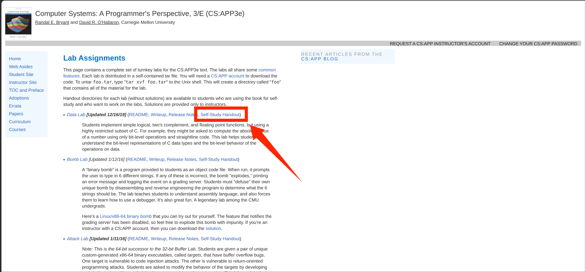

**在此感谢本文主要笔者 25级ACM俱乐部成员 Chord**

# 关于本篇

CSAPP 是非常经典的用于理解计算机系统底层原理的一门课,本篇主要记录我在完成 lab 时候的部分思路以及遇到的问题可供各位参考
> 涉嫌剧透,如果你想自己体验探索过程建议先自己试一遍再来看

---

该课程共 11(实际只用学习 8 个就可以了) 个 lab 各个 lab 你所能学到的知识如下:

1. Data Lab	二进制、补码、位运算、IEEE 754 浮点表示
2. Bomb Lab	用 gdb、objdump 反汇编并逆向程序,读懂 x86-64 汇编、栈帧、分支、递归、跳转表和链表
3. Attack Lab 缓冲区溢出、栈破坏、代码注入与 ROP,理解调用约定、返回地址,以及程序为什么会有此类安全漏洞
4. Buffer Lab（旧版 IA32）Attack Lab 的 32 位旧版本,主题相同,做 Attack Lab 后无需再做它
5. Architecture Lab（Y86-64）修改 Y86-64 流水线处理器与程序来降低 CPE,理解流水线、冒险、转发、分支预测,以及软硬件协同优化
6. Architecture Lab（旧 Y86）上项的 32 位历史版本,做新版 Y86-64 Architecture Lab 即可
7. Cache Lab 编写 Cache 模拟器、优化矩阵转置,掌握组相联、LRU、局部性、cache miss,以及访问模式如何决定性能
8. Performance Lab 针对卷积/矩阵等内核做低层优化,理解循环展开、减少访存、局部性,官网说明它通常已被 Cache Lab 替代
9. Shell Lab 实现带作业控制的小型 Unix shell,掌握 fork、execve、进程组、前后台作业、信号及竞争条件
10. Malloc Lab 自己实现 malloc / free / realloc,深入理解堆、块布局、空闲链表、合并、碎片,以及时间—空间权衡
11. Proxy Lab 实现并发、带缓存的 HTTP Web 代理,把 socket、HTTP、I/O、线程、同步、缓存等知识串成一个完整系统

实际上推荐你按如下顺序做即可:  
Bomb → Data → Attack → Architecture → Cache → Shell → Malloc → Proxy (共计 8 个)

由于该课程难度较大,而且如今 ai 发展迅猛,各位可以多多借助 ai 辅助学习(还是建议各位手敲感受下计算机底层,会更助于你理解计算机系统)

贴主的运行系统为 Ubuntu26.04(即 Linux) 可能部分代码块与在 windows 上的不一样,希望各位理解

> 对于 windows 用户部分 lab 由于没有直接的 x86-64 可执行文件,推荐用户安装 wsl Ubuntu 或者 Linux 系统来进行接下来的学习
> wsl 安装可以看该 up 主的视频教程 [点击跳转](https://www.bilibili.com/video/BV1tW42197za/?spm_id_from=333.337.search-card.all.click&vd_source=eedb86942585e2b43ca4a642210708b4)

准备好了? 那么,发车!

## lab 下载及使用

各位可以访问该网站 [点击此处](https://csapp.cs.cmu.edu/3e/labs.html) 获取 lab 压缩包

进入网站后有各 lab 信息,各位可点击 lab 后的 Self-Study Handout 按键下载压缩包以自学

下载完后将压缩包解压到你想放的文件夹便可开始你的 lab 学习之旅了

## 各 lab 直达

[Bomb 点击跳转](http://csdiy.wustacm.com/CSAPP/CSAPP-bomb-lab.html)

Data(施工中)

Attack(施工中)

Architecture(施工中)

Cache(施工中)

Shell(施工中)

Malloc(施工中)

Proxy(施工中)