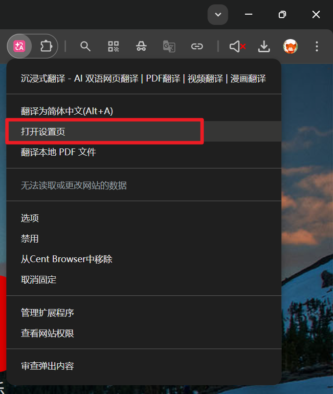
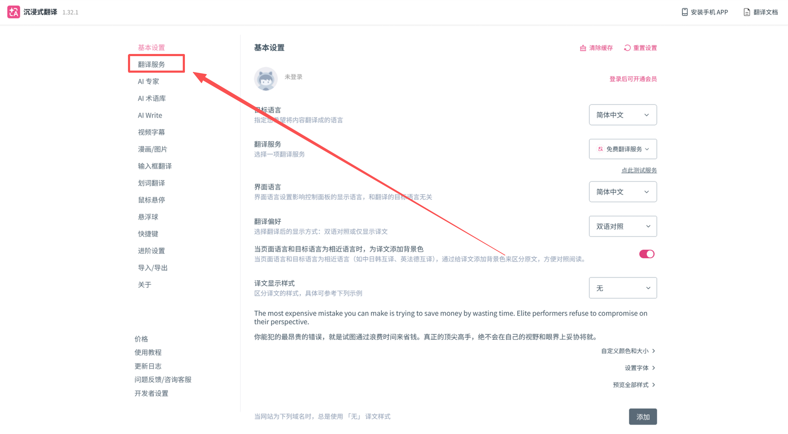
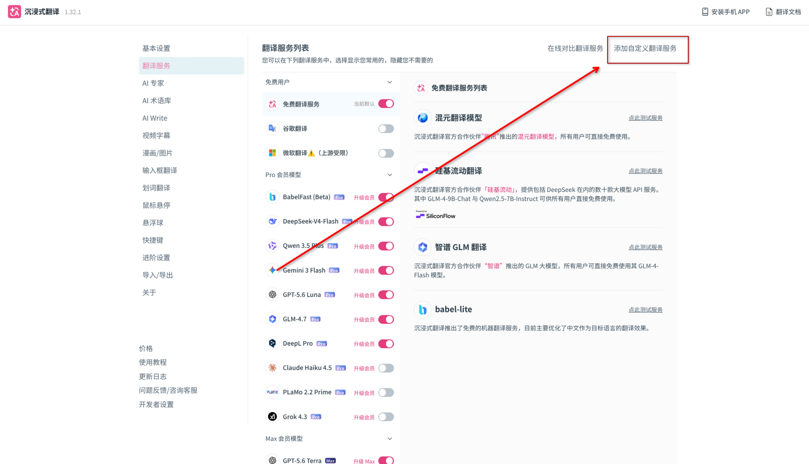
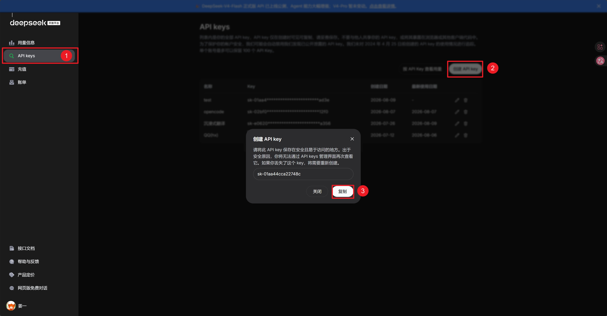
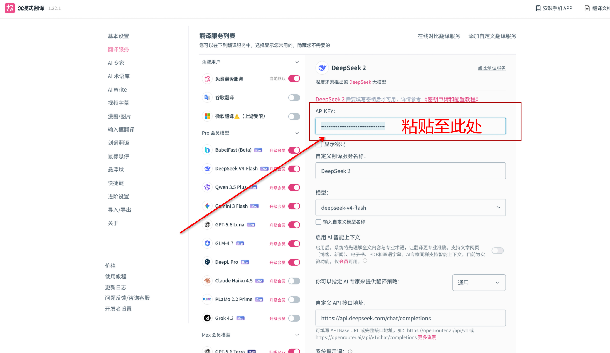
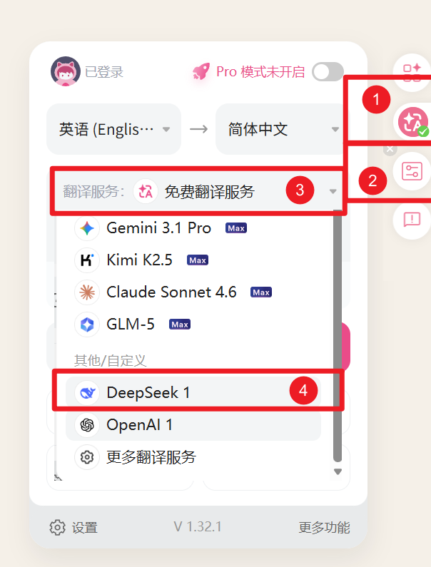

**在此感谢本文主要笔者 24级ACM俱乐部成员 shoper**

# ai 翻译插件配置

## 1.前言

### 1.1必要性：

无论是在算法学习或者学习 csdiy 的课程，与英文文档打交道都是不可避免的，但是往往浏览器自带的机翻，非常差劲，毕竟对于大量的专业名词动词，机翻往往不能翻译恰当。这些都是计算机学习的第一道障碍......

### 1.2功能：

而 ai 翻译插件，是通过调用 ai 接口，实现 ai 智能翻译，ai 的优势在于，它可以根据情景翻译出恰当的语义，并且下面介绍的插件翻译，实现的是一段一翻，也就是说，会有一段原文紧接着一段译文，这样也方便使用者对比适当学习英语~~如果你愿意的话~~

## 2.配置教程

### 2.1下载插件

- [沉浸式翻译🔗](https://microsoftedge.microsoft.com/addons/detail/%E6%B2%89%E6%B5%B8%E5%BC%8F%E7%BF%BB%E8%AF%91-%E7%BD%91%E9%A1%B5%E7%BF%BB%E8%AF%91%E6%8F%92%E4%BB%B6-pdf%E7%BF%BB%E8%AF%91-/amkbmndfnliijdhojkpoglbnaaahippg) 打开这个插件，并点击`获取`，获取成功后，插件会出现在浏览器的右上角`🧩`，然后右键`沉浸式翻译图标`，点击`打开设置页` （如下图所示

- 点击左侧栏第二项`翻译服务` 

- 点击右上角`添加自定义翻译服务`

- 选择`DeepSeek`，暂且搁置此页面。现在我们需要先去获取DeepSeek的API。

### 2.2获取API Key

- 点击打开 [DeepSeek开放平台🔗](https://platform.deepseek.com/)，注册并登录
- 登录后，点在左侧栏的 `充值`（充值一个小数额即可，翻译对token的消耗量较小，够用很久了）
- 然后我们按照如下步骤，创建API key。

### 2.3配置插件

- 现在，我们回到刚刚搁置的插件配置页面，在此处粘贴刚刚复制的API Key。

- 点击右上角 `点此测试服务`，如果出现`✅` 就说明API Key配置成功。

至此，恭喜完成沉浸式翻译插件的安装和简单配置

## 使用设置

- 接下来打开[测试网站🔗](https://en.test.jianges.com/)

- 可以观察到网页右侧有个粉色小按钮，鼠标移动至按钮上方（不点击）后，正下方会展开有 `控制面板` `🎛`，点击打开
- 然后我们点击 `翻译服务`，会出现许多模型，我们要下滑到最后，选择 `其他/自定义`中的 `DeepSeek 1` 模型。 

- 至此彻底完成配置，之后再使用翻译只需点击这个粉色小按钮稍待即可翻译成功！
