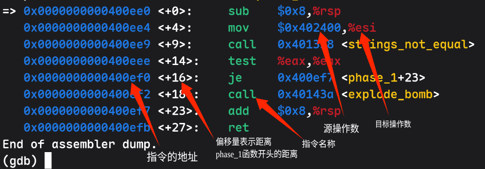

**在此感谢本文主要笔者 25级ACM俱乐部成员 Chord**

# GDB 食用指南

本篇介绍 GDB 的安装和基本使用

GDB（GNU Debugger）是一个命令行调试工具，可以暂停程序、查看汇编指令、寄存器和内存，并且逐条执行程序

对于有汇编,反编译需求的 lab, GDB 是一个非常好用的工具

## 环境准备

Lab 通常提供 Linux x86-64 环境下的可执行文件  
Windows 用户需要注意，Windows 原生环境不能直接运行这类 Linux ELF 程序，推荐使用 WSL2 Ubuntu 或 安装 Linux 系统

WSL 安装可以参考：[WSL 安装教程](https://www.bilibili.com/video/BV1tW42197za/?spm_id_from=333.337.search-card.all.click&vd_source=eedb86942585e2b43ca4a642210708b4)

### Ubuntu / Debian 安装 GDB

先检查 GDB 是否已经安装：

```bash
gdb --version  # 先检查 GDB 是否安装
```

如果提示 `command not found`，执行：

```bash
sudo apt update
sudo apt install gdb
```

如果之后还要编译其他 Lab，可以一起安装编译工具：

```bash
sudo apt install build-essential gdb
```

然后再运行程序。

## GDB 的基本操作

GDB 的基本操作主要包括：

1. 启动和退出 GDB
2. 设置断点
3. 运行和继续程序
4. 查看代码、寄存器和内存
5. 单步执行

## 启动和退出 GDB

进入可执行文件所在目录后运行：

```bash
gdb ./你的可执行文件
```

如果还需要指定源代码搜索目录，可以使用：

```bash
gdb -d . ./bomb
```

> 这里的 `-d .` 表示把当前目录加入源代码搜索路径

进入 GDB 后会看到：

```text
(gdb)
```

退出 GDB：

```gdb
quit
```

也可以简写为：

```gdb
q
```

> 如果 GDB 询问是否退出正在运行的程序，输入 `y`

## 设置断点

断点表示：程序运行到指定位置时暂停

```gdb
break phase_1
```

也可以简写为：

```gdb
b phase_1
```

## 运行和继续执行

启动程序：

```gdb
run
```

也可以简写为：

```gdb
r
```

如果程序暂停在断点处，使用下面的命令继续执行：

```gdb
continue
```

也可以简写为：

```gdb
c
```

> 如果程序已经运行过，再次输入 `run`，GDB 可能会询问是否从头开始；输入 `y` 即可

## 查看汇编代码和寄存器

查看指定函数的汇编代码：

```gdb
disassemble phase_1
```

也可以简写为：

```gdb
disas phase_1
```

查看当前指令附近的 10 条汇编指令：

```gdb
x/10i $rip
```

> 其中 `$rip` 是当前指令地址，`i` 是 instruction 的缩写

### 汇编输出示例

下面是使用 `disassemble phase_1` 后的输出示例：



阅读这类输出时，可以先关注以下几部分：

```text
=>                 当前暂停位置
0x400ee0           指令在内存中的地址
<+0>               距离当前函数开头的字节偏移量
sub                汇编指令名称
$0x8,%rsp          指令操作的参数
```

> 左侧的 `=>` 表示程序当前停在这一条指令上  
> `call` 后面的地址和函数名表示被调用的函数，例如 `strings_not_equal`

查看所有寄存器：

```gdb
info registers
```

也可以简写为：

```gdb
i r
```

在 Linux x86-64 的函数调用约定中，经常会用到以下寄存器：(可以与图中对照)

```text
$rax：函数返回值
$rdi：第一个函数参数
$rsi：第二个函数参数
$rsp：栈顶指针
$rip：当前指令地址
```

## 查看内存内容

GDB 使用 `x`（examine）命令查看内存

```gdb
x/s 地址
x/d 地址
x/x 地址
x/16bx 地址
x/10i 地址
x/10gx $rsp
```

这些命令分别表示：

```text
x/s 地址       按字符串显示地址处的内容
x/d 地址       按十进制显示
x/x 地址       按十六进制显示
x/16bx 地址    查看 16 个字节，并以十六进制显示
x/10i 地址     查看 10 条汇编指令
x/10gx $rsp    查看栈顶附近的 10 个八字节数据
```

## 单步执行

分为两种 `nexti` 和 `stepi`

nexti 执行下一条汇编指令，遇到 `call` 时通常跳过被调用函数：

```gdb
nexti
```

简写为：

```gdb
ni
```

stepi 执行下一条汇编指令，遇到 `call` 时进入被调用函数：

```gdb
stepi
```

简写为：

```gdb
si
```

finish 继续执行，直到当前函数返回：

```gdb
finish
```

> 没错吧其实就是个调试工具跟你平时在 vscode 上一样的只不过是指令形式而不是 GUI  
> 各位可以上手试一下控制台调试,多敲敲自然会上手的
